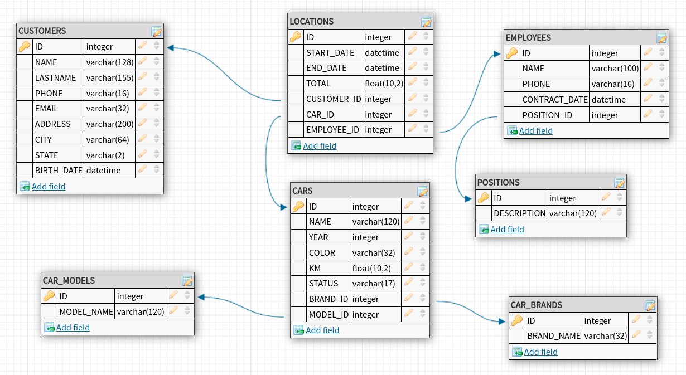

# Vehicle Rental Database Project 🚗📊

# Introduction
The project aims to build a real database for a vehicle rental company. During the execution of this challenge, you will have the opportunity to practice and refine all the SQL basic skills.

ADVISE: Some queries hasn't the most desirable method, like search for a specific entry to update with a column that are not unique, but it intends to be academic and theorical. So I kept doing what has been taught in the basics of the course.

***

# Project Summary
Our project will be to build a database responsible for managing data for a vehicle rental company. The database should be able to store data for both customers, employees, and existing positions, as well as models, brands, vehicles, and rental information for the company's customers.

***

# How to run

You may simply clone this repository and run the queries in the SGBD workbench you prefer.

Good luck with happy coding! 🧙‍♂️
